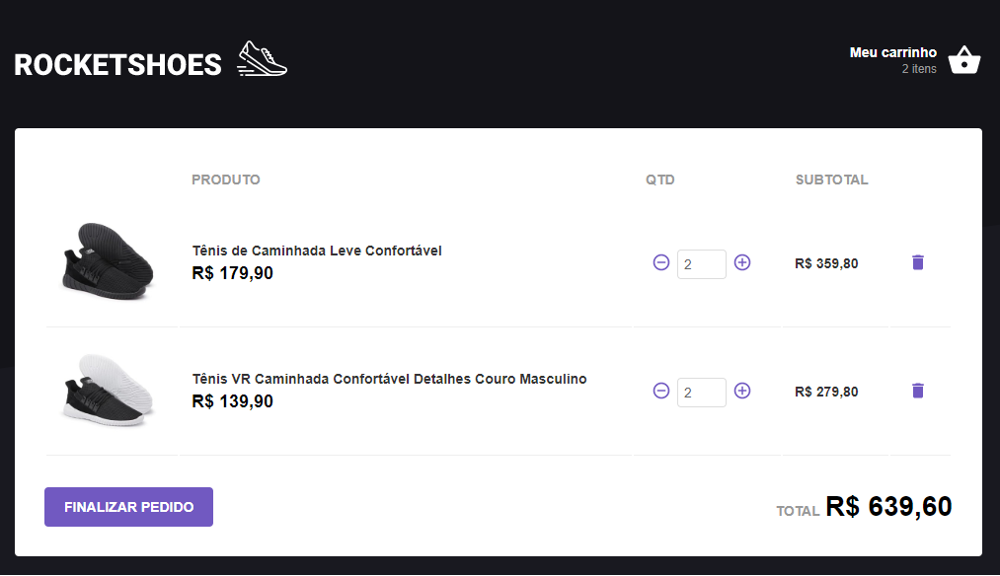

## O que é?
Projeto React utilizando arquitetura flux com redux e redux saga.

## Tecnologias
- Javascript
- React
- Axios
- Redux
- Redux Saga
- Styled Components
- Json Server

## Web
<p align="center">
  
  
</p>

## Como executar?
Para baixar as dependências do projeto utilizar o comando abaixo:
```
yarn
```
Para executar:
```
yarn start
```

## Instalar o json-server
O json-server é bem util para que possamos simular uma API Rest
<br>
Instalando global:
```
npm i -g json-server
```
Rodando o servidor
```
json-server --watch server.json --port 3333
```
